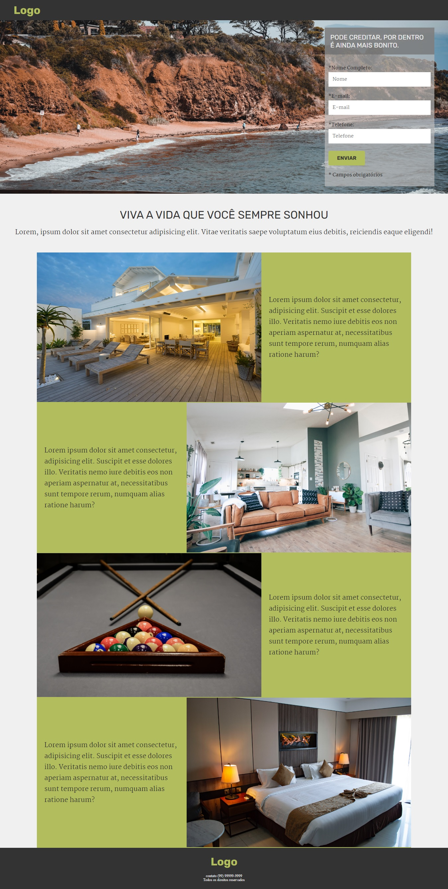

# Projeto exemplo 2 

## Sobre

Esse projeto foi feito a partir de uma adaptação de um projeto de um curso como forma de aprendizado

## Características

- [x] Mobile first
- [x] Responsivo

## Tecnologias usadas

- [HTML]
- [CSS]

### Telas

<h2>
  
</h2>

---

Feito por Jackson Gravino
